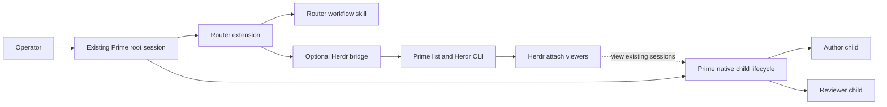
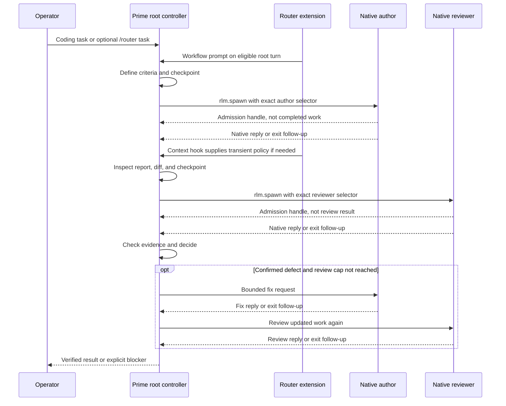
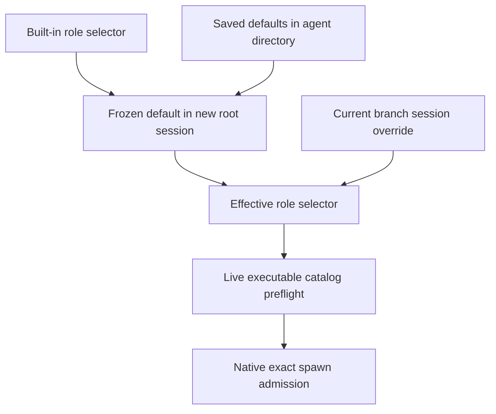

# Architecture

[Overview](README.md) · [Getting started](GETTING_STARTED.md) · [Security](SECURITY.md) · [Contributing](CONTRIBUTING.md) · [Changelog](CHANGELOG.md) · [License](LICENSE.md)

Router is an extension plus a controller workflow for **one existing Prime Agent root session**. Prime, not Router, owns model calls, native child admission, child messages, and the agent tree. The optional Herdr bridge creates terminal *viewers* of those children, not agents. The package is private in this checkout; this document does not claim a published release or verified live Herdr sidebar integration.

## Components and ownership



| File | Responsibility |
| --- | --- |
| `package.json` | Declares the `pi` extension and skill, engine/dependencies, package file list, and local checks. |
| `extensions/router.ts` | Root/depth and active-model gates; role settings; workflow prompt/context hooks; `/router` command; Herdr event wiring. |
| `skills/router/SKILL.md` | Controller instructions for native author/reviewer delegation, checkpoints, recovery, and bounded review. It is policy, not a scheduler or permission system. |
| `extensions/herdr.ts` | Optional caller/transport validation, native child discovery, viewer reconciliation, and owned-pane cleanup. |
| `bin/herdr-bind.mjs` | Advanced, short-lived local descriptor for manual caller binding; not needed for normal one-command setup. |
| `tests/*.test.mjs` | Local extension, bridge, and packaging tests; mock bridge tests do not establish live Herdr sidebar recognition. |

Only `extensions/router.ts` is registered as a `pi` extension; it imports `extensions/herdr.ts`. The extension reads the skill file at runtime. The built-in selectors are controller `openai-codex/gpt-6-astra`, author `openai-codex/gpt-5.6-sol`, and reviewer `openai-codex/gpt-5.6-luna`. They are defaults, not fallback models.

## Turn and native-child lifecycle



The `before_agent_start` hook adds a marker-bounded workflow block to the existing system prompt only when the session header has **exactly** `rlmDepth === 0` and the active parent model exactly matches the effective controller selector. It replaces its own bounded block rather than accumulating copies. Current Prime behavior bypasses this hook for explicit native child replies and resets the effective system prompt there; the `context` hook supplies transient custom instructions before the provider call if the current block is absent. It strips its own stale context message when no longer eligible. Neither hook spawns an agent, queues a follow-up, nor switches the parent model. A future host change may require retesting that hook behavior.

`/router <task>` is optional: after active-controller matching and live `getExecutableModels()` checks for **both** effective child selectors, it sends the workflow and task to the existing parent (as a follow-up when busy). Missing discovery or missing executable models blocks dispatch. Catalog discovery is a preflight, not authorization or proof of `rlm.spawn` access. Native exact admission remains authoritative; no substitute selector is chosen. Normal coding turns can follow the same skill without the command. Unknown depth fails closed, and native children (`rlmDepth > 0`) cannot activate the extension even if they happen to use the controller model.

The skill asks the controller to check existing edits, then save a compact `.router/runs/<run-id>/state.json` checkpoint unless local artifacts are forbidden. It records phase, scope, child IDs, review count, and evidence; the working tree must be rechecked on resume. Independent, nonoverlapping author scopes may run in parallel. The reviewer is asked to inspect and run checks without editing. Default cap: **three author-to-reviewer rounds per step**. For a missing child report, the controller can recover handles with `rlm.list_subagents()`, inspect a nonblocking `rlm.collect(..., timeout_ms=0)` snapshot or bounded observation, and try at most **two** native recovery attempts. A no-reply exit is not success. It should do the next useful step on a delivered follow-up, then stop for an operator at a persistent blocker. The skill cannot guarantee progress when the host pauses, loses, or does not deliver a follow-up; it does not run a timer or autonomous scheduler.

## Role configuration



Effective precedence for each role is **current branch override → frozen session default → built-in selector**. `getAgentDir()/router/models.json` holds saved defaults for *new* sessions. On first valid root initialization, Router snapshots them in branch-local `router-models-v1` metadata; saved changes do not change existing snapshots. `/router model <role> <selector>` changes this session's override while idle; `/router default <role> <selector>` saves a new-session default; `/router reset <role|all>` removes overrides while idle, exposing the *frozen* default, even if stale. Bare `/router` shows status and, with UI, offers role/model/scope pickers; `/router models` shows effective settings. A saved default can change while busy, but current-session changes cannot reroute in-flight work. Router does not migrate old values on a built-in change. The operator must separately select the actual parent model; configuring a controller selector never switches it.

Selectors must be syntactically valid `provider/model-id` values and command-set selections must appear in Prime's live executable catalog. A frozen old value can become unavailable later; dispatch fails rather than silently falling back. Corrupt saved JSON blocks new snapshots and saved-default writes, while an already valid session snapshot can still operate. Router reports errors instead of repairing configuration silently.

## Optional Herdr binding and reconciliation

```mermaid
sequenceDiagram
    participant H as Herdr command client
    participant P as Prime command host
    participant R as Router bridge
    participant L as Prime daemon list
    participant D as Herdr CLI
    H->>P: /router herdr on in existing root
    P->>R: Command-scoped invoking client context
    R->>R: Validate caller and bound transport
    R->>D: Get and verify caller pane
    R->>L: list --json on bound daemon
    L-->>R: Live root and direct native children
    R->>D: Strict workspace pane list and bound-origin check
    loop Retained viewers first; up to eight slots
        R->>D: Split no-focus sibling pane if slot free
        R->>D: Set metadata and ownership token
        R->>D: Run prime-agent attach to child session
        R->>D: Report working only on positive native activity
    end
    R->>R: Persist owned viewers; defer excess children
```

Herdr starts **off**. Normal `/router herdr on` requires the optional command-only Prime host API `ctx.getInvokingClientContext?()`: `{env, daemonSocketPath, launcherPath}` from the actual attached command client. The host must forward it across supervisor and session-worker boundaries. The bridge validates genuine Herdr workspace/tab/pane/socket fields and an explicit executable launcher and absolute daemon socket. It never infers these from focus, a default socket, or stale worker environment on this path; missing API or caller refuses binding. This capability requires updated runtime code in **both daemon and session worker**. Restart those processes with the host's supported lifecycle and resume the *same saved root session*; `/reload` cannot install a missing host API. No released host version is asserted. An older inherited-context binding with no saved caller identity must first be turned off from its original Herdr environment.

Advanced options are explicit `/router herdr on <absolute-daemon-socket> <absolute-prime-launcher>` with genuine inherited Herdr environment, or `bin/herdr-bind.mjs` in a real Herdr pane followed by `/router herdr bind <absolute-descriptor-path>` in the same root. The helper creates a private `0700` directory and `0600` descriptor with a 120-second expiry; bind atomically claims it once, checks root and file identity/permissions, then removes it even on sync failure. These paths do not replace the normal command-client API; whitespace in explicit command arguments is unsupported. See [Security](SECURITY.md) for the same-UID threat boundary.

A bridge snapshot (`router-herdr-v1`) in branch-local session metadata records enabled state, transport, saved caller context where applicable, and up to eight owned viewer records for reload/resume. Invalid records fail closed. Before reconciliation, the bridge checks the caller pane and requires the selected daemon's public `prime-agent list --json` to contain the exact *live top-level root*. Only live `rlmDepth === 1` direct children with authoritative, nonduplicated IDs, model, name, and working directory are considered; malformed records fail rather than inviting a guessed attach. Each sibling pane runs `prime-agent attach <child-session-id> --daemon-socket <bound-socket>` via the bound launcher. This shows the **existing** child; it never spawns a second agent. Role labels are only unique exact model-match hints (`author`, `reviewer`, or `worker`), not proof of a prompt's role. A viewer reports `working` only when the native roster explicitly says `isStreaming === true` or `isCompacting === true`; otherwise it reports `unknown`, never inferred `idle`, `blocked`, or `done`.

The installed Herdr **0.9.1 / protocol 22** contract returns a successful `pane_list` scoped by `--workspace`. After checking the bound caller pane, the bridge validates the native roster and the *complete* workspace pane inventory, including the original caller pane in its expected tab, **before any viewer mutation**. Malformed/duplicate entries, wrong workspace, missing origin, or CLI/server errors abort reconciliation: no ambiguous missing-pane inference. Successful inventory proves a previously tracked pane absent from that workspace, so its stale record can be dropped; an active child may then get a fresh viewer. For a present pane, closing requires an exact verified workspace, tab, ID, and `router_owner` token. A mismatched token or changed native child session identity retains the record for manual recovery rather than rebinding or closing it. Existing tracked viewers keep slots; roster-order newcomers fill spare slots up to eight, and additional children are **deferred**, not a whole-sync error. These guarantees depend on the matched Herdr protocol; retest on a Herdr upgrade.

Root `tool_execution_end` and `agent_end` events trigger a coalesced reconciliation: concurrent requests share pending work and request one further pass when dirty. There is **no polling timer**. Child-only transitions may remain stale until another parent event or `/router herdr sync`. `/router herdr off` invalidates pending work and closes only exactly verified owned panes; proven-absent records are dropped. A split or failure before ownership metadata lands can leave a tracked, unverified orphan: Router does not close it without a matching token. Failed cleanup is reported for manual recovery, not handled by closing unrelated panes; native child sessions remain alive. Status hides transport paths and arbitrary errors, reports fixed error categories, last successful sync, deferred count, observed activity, and tracked viewer count as **ownership not currently verified**. That status and pane metadata do **not** prove live Herdr Agents-sidebar registration. Mock tests cover protocol behavior, not real integration; a live test is still needed. A dashboard fallback is not the design target.

## Tradeoffs and failures

- **Prompt policy rather than a new orchestration engine:** native visibility and one session remain intact, but controller compliance and continuation are not hard guarantees.
- **Frozen session roles:** repeatable configuration for a resumed branch, at the cost of needing explicit overrides when saved defaults or model access change.
- **Exact, bounded identities:** depth, models, caller context, daemon root, and pane ownership fail closed. This can refuse old hosts, ambiguous sessions, or incomplete metadata instead of guessing.
- **Event-driven viewers:** no extra agent or polling load, but Herdr snapshots can lag and live sidebar display is unverified. Failed list, split, attach, or cleanup needs an explicit error/retry or manual recovery; reported pane creation alone is not success.
